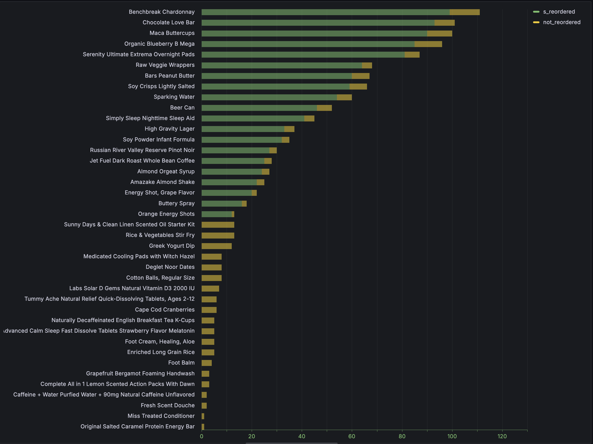
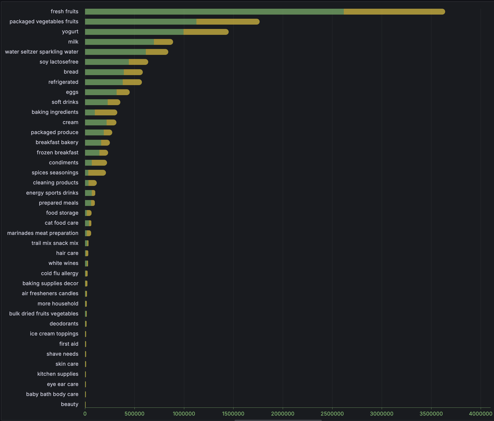

Visualizations made by [Grafana](https://grafana.com/) using dashboard with MySQL data source.

All data is checked using `order_products__prior` database, because it has similar distributions to `order_products__train`.

- What are the top 20 most/least frequently purchased products?
```sql
WITH product_cnt AS (
    SELECT product_name, COUNT(order_id) AS cnt
    FROM order_products__prior
        INNER JOIN products USING (product_id)
    GROUP BY product_id
)
SELECT * FROM (
    SELECT * FROM product_cnt ORDER BY cnt DESC LIMIT 20
) AS top_products
UNION ALL
SELECT * FROM (
    SELECT * FROM product_cnt ORDER BY cnt LIMIT 20
) AS bottom_products;
```


- What are the top 20 most/least reordered products?
```sql
WITH product_reorders AS (
    SELECT product_name, AVG(reordered) AS cnt
    FROM order_products__prior
        INNER JOIN products USING (product_id)
    GROUP BY product_id
)
SELECT * FROM (
    SELECT * FROM product_reorders ORDER BY cnt DESC LIMIT 20
) AS top_products
UNION ALL
SELECT * FROM (
    SELECT * FROM product_reorders ORDER BY cnt LIMIT 20
) AS bottom_products;
```



- What are the top 20 most/least frequently purchased aisles?
```sql
WITH aisle_cnt AS (
    SELECT ANY_VALUE(aisle), COUNT(order_id) AS cnt
    FROM order_products__prior
        INNER JOIN products USING(product_id)
        INNER JOIN aisles USING(aisle_id)
    GROUP BY aisle_id
)
SELECT * FROM (
    SELECT * FROM aisle_cnt ORDER BY cnt DESC LIMIT 20
) AS top_aisles
UNION ALL
SELECT * FROM (
    SELECT * FROM aisle_cnt ORDER BY cnt LIMIT 20
) AS bottom_aisles
```


- What are the top 20 most/least reordered aisles?
```sql
WITH top_aisles  AS (
    SELECT ANY_VALUE(aisle), AVG(reordered) AS cnt
    FROM order_products__prior
        INNER JOIN products USING (product_id)
        INNER JOIN aisles USING (aisle_id)
    GROUP BY aisle_id
)
SELECT * FROM (
    SELECT * FROM top_aisles ORDER BY cnt DESC LIMIT 20
) AS top_aisles
UNION ALL
SELECT * FROM (
    SELECT * FROM top_aisles ORDER BY cnt LIMIT 20
) AS bottom_aisles
```



- top/botoom 10 aisles by products count
```sql
WITH aisle_products AS (
    SELECT ANY_VALUE(aisle), COUNT(product_id) AS cnt_products
    FROM instacart.products
        INNER JOIN aisles USING (aisle_id)
    GROUP BY aisle_id
)
SELECT * FROM (
    SELECT * FROM aisle_products ORDER BY 2 DESC LIMIT 20
) AS top_aisles
UNION ALL
SELECT * FROM (
    SELECT * FROM aisle_products ORDER BY 2 LIMIT 20
) AS bottom_aisles
```


- departments with highest/lowest number of sales
```sql
WITH department_cnt AS (
    SELECT ANY_VALUE(department), COUNT(order_id) AS cnt
    FROM order_products__prior
        INNER JOIN products USING (product_id)
        INNER JOIN departments USING (department_id)
    GROUP BY department_id
)
SELECT * FROM department_cnt ORDER BY cnt DESC
```


- top 20 products added to the cart first
```sql
WITH first_products AS (
    SELECT product_id, COUNT(order_id) AS cnt
    FROM order_products__prior
    WHERE add_to_cart_order = 1
    GROUP BY 1
    ORDER BY 2 DESC
    LIMIT 10
)
SELECT product_name, cnt
FROM
    first_products INNER JOIN products USING (product_id)
ORDER BY 2 DESC;
```


- top 20 aisels added to the cart first
```sql
SELECT ANY_VALUE(aisle), COUNT(order_id) AS cnt
FROM order_products__prior
    INNER JOIN products USING (product_id)
    INNER JOIN aisles USING (aisle_id)
WHERE add_to_cart_order = 1
GROUP BY aisle_id
ORDER BY 2 DESC
LIMIT 10
```


- Products with least percentage of reorderings by users? This can be products with bad quality, rarely purchased goods like household chemicals or may be this product is not more exist at stores. You can note, that we try to find not simple avg of reordered field, but the fraction of number of buyings to total number of buys

```sql
WITH reorder_frac AS (
    SELECT
        op.product_id,
        o.user_id,
        COUNT(op.order_id) OVER (PARTITION BY o.user_id, op.product_id) / MAX(o.order_number) OVER (PARTITION BY o.user_id) AS reorders
    FROM
        order_products__prior op
        INNER JOIN orders o USING (order_id)
)
SELECT
    rf.product_id,
    p.product_name,
    AVG(rf.reorders) AS avg_reorders
FROM
    reorder_frac rf
    INNER JOIN products p USING (product_id)
GROUP BY
    rf.product_id, p.product_name
ORDER BY
    avg_reorders
LIMIT 10;
```

This version is very slow and we got `Error Code: 2013. Lost connection to MySQL server during query`
So, lets take optimize query. Index was generated through UI, and that returns such code

```sql
-- orders
CREATE UNIQUE INDEX `idx_orders_order_id`  ON `instacart`.`orders` (order_id) COMMENT '' ALGORITHM DEFAULT LOCK DEFAULT
CREATE UNIQUE INDEX `idx_orders_order_id_user_id`  ON `instacart`.`orders` (order_id, user_id) COMMENT '' ALGORITHM DEFAULT LOCK DEFAULT;

-- products
CREATE UNIQUE INDEX `idx_products_product_id`  ON `instacart`.`products` (product_id) COMMENT '' ALGORITHM DEFAULT LOCK DEFAULT;

-- order_products__prior
CREATE INDEX `idx_order_products__prior_order_id`  ON `instacart`.`order_products__prior` (order_id) COMMENT '' ALGORITHM DEFAULT LOCK DEFAULT;
CREATE UNIQUE INDEX `idx_order_products__prior_order_id_product_id`  ON `instacart`.`order_products__prior` (order_id, product_id) COMMENT '' ALGORITHM DEFAULT LOCK DEFAULT;

-- order_products__train
CREATE INDEX `idx_order_products__train_order_id`  ON `instacart`.`order_products__train` (order_id) COMMENT '' ALGORITHM DEFAULT LOCK DEFAULT;
CREATE UNIQUE INDEX `idx_order_products__train_order_id_product_id`  ON `instacart`.`order_products__train` (order_id, product_id) COMMENT '' ALGORITHM DEFAULT LOCK DEFAULT;
```

So before we had large joins with window functions, that at least can take excessive memory. We rewrite this as several sequential steps for optimizing speed and memory

```sql
WITH user_order_stats AS (
    SELECT
        o.user_id,
        MAX(o.order_number) AS max_order_number
    FROM
        orders o
    GROUP BY
        o.user_id
),
product_reorders AS (
    SELECT
        op.product_id,
        o.user_id,
        COUNT(op.order_id) AS reorder_count
    FROM
        order_products__prior op
        INNER JOIN orders o USING (order_id)
    GROUP BY
        op.product_id, o.user_id
),
reorder_frac AS (
    SELECT
        pr.product_id,
        pr.user_id,
        pr.reorder_count / uos.max_order_number AS reorders
    FROM
        product_reorders pr
        INNER JOIN user_order_stats uos ON pr.user_id = uos.user_id
)
SELECT
    rf.product_id,
    p.product_name,
    AVG(rf.reorders) AS avg_reorders
FROM
    reorder_frac rf
    INNER JOIN products p USING (product_id)
GROUP BY
    rf.product_id, p.product_name
ORDER BY
    avg_reorders
LIMIT 20;
```


As we can see mostly here is vitamins/sport nutrition/household chemicals. But also we can see aleppo peper, tea, that we eat some time.